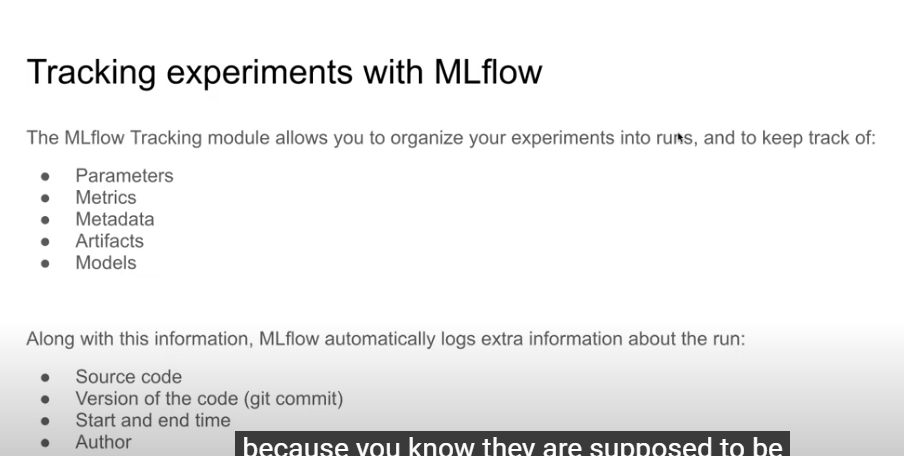

## Second Week of the Zoomcamp
## Import Concepts
* ML Experiment: the process of building an ML model.
* Experiment run: each trial in an ML experiment.
* Run artifact: any file that is associated with an ML run.
* Experiment metadata : Result of all the runs of an experiment.

## Why is experiment tracking important?
* Reproducibility: if you run the same experiment multiple times, you will get the same results.
* Organization : You can organize your experiments in folders and subfolders.
* Optimization: You can run the same experiment multiple times with different hyperparameters.

## Tracking experiments in spreadsheets
## Why is not enough?
* Error prone
* No standard format
* Visibility and Collaboration
## MLflow
An open source plattform for the machine learning research.
It's just a python library that allows you to track your experiments and it contains:
* Tracking
* Models
* Model Registry
* Projects



## I'll use conda for create a environment for my experiments with Python = 3.9
```
conda create -n mlflow_enviroment python=3.9
```
## Activate enviroment
```
activate mlflow_enviroment
```

## Install Mlflow with this command
```
pip install mlflow
```

## Install all the libraries that we gonna use
```
pip install -r requirements.txt
```
## Run MLflow UI with backend configure (Remember to put this command in path of the files that you want to track)
```
mlflow ui --backend-store-uri=sqlite:///mlflow.db
```

## Hyperparameter Optimizaiton Tracking:

By wrapping the `hyperopt` Optimization objective inside a `with mlflow.start_run()` block, we can track every optimization run that was ran by `hyperopt`. We then log the parameters passed by `hyperopt` as well as the metric as follows:

```python


import xgboost as xgb

from hyperopt import fmin, tpe, hp, STATUS_OK, Trials
from hyperopt.pyll import scope

train = xgb.DMatrix(X_train, label=y_train)
valid = xgb.DMatrix(X_val, label=y_val)

def objective(params):
    with mlflow.start_run():
        mlflow.set_tag("model", "xgboost")
        mlflow.log_params(params)
        booster = xgb.train(
            params=params,
            dtrain=train,
            num_boost_round=1000,
            evals=[(valid, 'validation')],
            early_stopping_rounds=50
        )
        y_pred = booster.predict(valid)
        rmse = mean_squared_error(y_val, y_pred, squared=False)
        mlflow.log_metric("rmse", rmse)

    return {'loss': rmse, 'status': STATUS_OK}

search_space = {
    'max_depth': scope.int(hp.quniform('max_depth', 4, 100, 1)),
    'learning_rate': hp.loguniform('learning_rate', -3, 0),
    'reg_alpha': hp.loguniform('reg_alpha', -5, -1),
    'reg_lambda': hp.loguniform('reg_lambda', -6, -1),
    'min_child_weight': hp.loguniform('min_child_weight', -1, 3),
    'objective': 'reg:linear',
    'seed': 42
}

best_result = fmin(
    fn=objective,
    space=search_space,
    algo=tpe.suggest,
    max_evals=50,
    trials=Trials()
)

```

In this block, we defined the search space and the objective than ran the optimizer. We wrap the training and validation block inside `with mlflow.start_run()` and log the used parameters using `log_params` and validation RMSE using `log_metric`.

In the UI we can see each run of the optimizer and compare their metrics and parameters. We can also see how different parameters affect the RMSE using Parallel Coordinates Plot, Scatter Plot (1 parameter at a time) and Contour Plot.
## Filter in the UI
```
tags.model='xgboost'
```
## Autologging: 

Instead of logging the parameters by "Hand" by specifiying the logged parameters and passing them. We may use the Autologging feature in MLflow. There are two ways to use Autologging; First by enabling it globally in the code/Notebook using 
```python
mlflow.autolog()
```

or by enabling the framework-specific autologger; ex with XGBoost:

```python
mlflow.xgboost.autolog()
```
Both must be done before running the experiments.

The autologger then not only stores the model parameters for ease of use, it also stores other files inside the `model` (can be specified) folder inside our experiment artifact folder, these files include:
+ `conda.yaml` and `requirements.txt`: Files which define the current envrionment for use with either `conda` or `pip` respectively
+ `MLmodel` an internal MLflow file for organization
+ Other framework-specific files such as the model itself
## Loading Models:

We can use the model to make predictions with multiple ways depending on what we need:
+ We may load the model as a Spark UDF (User Defined Function) for use with Spark Dataframes
+ We may load the model as a MLflow PyFuncModel structure, to then use to predict data in a Pandas DataFrame, NumPy Array or SciPy Sparse Array. The obtained interface is general for all models from all frameworks
+ We may load the model as is, i.e: load the XGBoost model as an XGBoost model and treat it as such

The first two methods are explained briefly in the MLflow artifacts page for each run, for the latter we may use (XGBoost example):
```python
logged_model = 'runs:/9245396b47c94513bbf9a119b100aa47/models' # Model UUID from the MLflow Artifact page for the run

xgboost_model = mlflow.xgboost.load_model(logged_model)
```
the resultant `xgboost_model` is an XGBoost `Booster` object which behaves like any XGBoost model. We can predict as normal and even use XGBoost Booster functions such as `get_fscore` for feature importance.
## Model Registry:

Just as MLflow helps us store, compare and deal with ML experiment runs. It also allows us to store Models and categoerize them. While it may be possible to store models in a folder structure manually, doing this is cumbersome and leaves us open to errors. MLflow deals with this using the Model Registry, where models may be stored and labeled depending on their status within the project.

### Storing Models in the Registry:

In order to register models using the UI, we select the run whose model we want to register and then select "Register Model". There we may either create a new model registry or register the model into an existing registry. We can view the registry and the models therein by selecting the "Models" tab in the top and selecting the registry we want.

### Promoting and Demoting Models in the registry:

Models in the registry are labeled either as Staging, Production or Archive. Promoting and demoting a model can be done by selecting the model in the registry and selecting the stage of the model in the drop down "Stage" Menu at the top.

## Interacting with MLflow through the Tracking Client:

In order to automate the process of registering/promoting/demoting models, we use the Tracking Client API initialized as described above:

```python
from mlflow.tracking import MlflowClient

MLFLOW_TRACKING_URI = "sqlite:///mlflow.db"

client = MlflowClient(tracking_uri=MLFLOW_TRACKING_URI)
```

we can then use the client to interface with the MLflow backend as with the UI.

### Selecting runs:

We can search for runs by ascending order of metric score using the API by:

```python
from mlflow.entities import ViewType

runs = client.search_runs(
    experiment_ids='1',    # Experiment ID we want
    filter_string="metrics.rmse < 7",
    run_view_type=ViewType.ACTIVE_ONLY,
    max_results=5,
    order_by=["metrics.rmse ASC"]
)
```
We can then get information about the selected runs from the resulting `runs` enumerator:
```python
for run in runs:
    print(f"run id: {run.info.run_id}, rmse: {run.data.metrics['rmse']:.4f}")
```

### Interacting with the Model Registry:

We can add a run model to a registry using:
```python
mlflow.set_tracking_uri(MLFLOW_TRACKING_URI)

run_id = "9245396b47c94513bbf9a119b100aa47"
model_uri = f"runs:/{run_id}/models"
mlflow.register_model(model_uri=model_uri, name="nyc-taxi-regressor")
```

we can get the models  in a model registry:
```python
model_name = "nyc-taxi-regressor"
latest_versions = client.get_latest_versions(name=model_name)

for version in latest_versions:
    print(f"version: {version.version}, stage: {version.current_stage}")
```

promote a model to staging:
```python
model_version = 4
new_stage = "Staging"
client.transition_model_version_stage(
    name=model_name,
    version=model_version,
    stage=new_stage,
    archive_existing_versions=False
)
```

update the description of a model:
```python
from datetime import datetime

date = datetime.today().date()
client.update_model_version(
    name=model_name,
    version=model_version,
    description=f"The model version {model_version} was transitioned to {new_stage} on {date}"
)
```

these can then be used to automate the promotion of packages into production or the archival of older models.