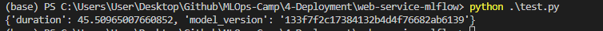

## Model Deployment
# 4. Model Deployment

## 4.1 Three ways of deploying a model
-   Batch Offline: You run your model regularly (hourly, daily, monthly). Pull the data from the DB and then apply the model.
-   Batch Online: It's running all the time. It's always available. You can run your models using Web Services (relationship 1 x 1 between client-server) and Streaming ( 1 x n relationship)


## 4.2 Web-services: Deploying models with Flask and Docker
### Install python, scikit learn and flask on a virtual environment with pipenv:
```
pipenv install scikit-learn==1.0.2 flask --python=3.9
```
### Go to the env with the command:
```
pipenv shell
```
## You can use anaconda to create the venv:
```
conda create -n web-service python=3.9
```
## Go to the env with the command:
```
conda activate web-service
```
### Install the dependencies:
```
pip install -r requirements.txt
```
## Work on predict.py
[See code here](web-service/)
## After you have finished predict.py and test.py, run predict.py on your virtual-enviroment and test.py on whatever you want to test your app.
```
(venv) python predict.py
(base) python test.py
```
- To avoid Flask warning, we can install gunicorn:
```
pip install gunicorn
```
## Run it using gunicorn:
```
gunicorn --bind=0.0.0.0:9696 predict:app
```
## Install requests on your virtual environment:
```
pip install requests
```
## Packaging the app to Docker:
- Create Dockerfile
- Make the image (make sure about your Python version, you can use python -V to check)
- Search for the python image in the Docker Hub, I'll select slim version (slim version is used for reducing the size of the image)
- Build the image with:
  ```
  docker build -t ride-duration-prediction-service:v1 . (Add winpty at the beggining to the command if you are using Windows)
  ```
  where:
  -   `ride-duration-prediction-service:v1` is the name of the image
  - t: v1 is the tag of the image
  -  `.` is the path to the directory where the Dockerfile is
- Test it with:
  ```
  docker run -it --rm -p 9696:9696  ride-duration-prediction-service:v1 and run the test.py
  ```
  where : 
  -   -it: Interactive mode
  -   --rm: Remove the container after it is done
  -   -p: Port mapping


## 4.3 Web-services: Getting the models from the model registry (MLflow)

[See content here](web-service-mlflow/)


### For this part, you'll need a S3 bucket.
I've just created a bucket called `mlflow-models-esteban`.
## Starting the MLflow server with S3:
```
mlflow server --backend-store-uri=sqlite:///mlflow.db --default-artifact-root=s3://mlflow-models-esteban/
```
## Run random-forest.ipynb
[Random Forest model](web-service/random-forest.ipynb)

## Run predict.py and then test.py to see if it works



## You can parameterize your RUN_ID an extract it from os.environ:

```
export MLFLOW_TRACKING_URI="http://127.0.0.1:5000"
export MODEL_RUN_ID="6dd459b11b4e48dc862f4e1019d166f6"

```
And add it to the predict.py file:

```
import os
RUN_ID = os.getenv('RUN_ID')
```


## For download artifact, you can use the following code:
```
mlflow artifacts download \
    --run-id ${MODEL_RUN_ID} \
    --artifact-path model \
    --dst-path .
```


## 4.4 (Optional) Streaming: Deploying models with Kinesis and Lambda 

## Follow the tutorial that I've provided in [Tutorial: Using Amazon Lambda with Amazon Kinesis](https://docs.amazonaws.cn/en_us/lambda/latest/dg/with-kinesis-example.html)
- Create your IAM role and policy. Name it `lambda-kinesis-role`
- Then go to Lambda and create a new function.
  - Name it `ride-duration-prediction-test`
  - Set Runtime to Python 3.9
  - Use a existing role: `lambda-kinesis-role`

## Create a new function as a :
```
import json

def lambda_handler(event, context):
    print(json.dumps(event))
    return {
        'statusCode': 200,
        'body': json.dumps('Hello from Lambda!')
    }
```

## To test it:
- Click in deploy
- Click in test 
  - Set the name of the test to `test`
  - Save it and then click in test 
- You should see the test result in the console
## Now we can test another function:
```
import json

def prepare_features(ride):
    features = {}
    features['PU_DO'] = '%s_%s' % (ride['PULocationID'], ride['DOLocationID'])
    features['trip_distance'] = ride['trip_distance']
    return features
    
def predict(features):
    return 10.0

def lambda_handler(event, context):
    ride = event['ride']
    ride_id = event['ride_id']
    
    features = prepare_features(ride)
    prediction = predict(features)
    
    #print(json.dumps(event))
    return {
        'ride_duration': prediction,
        'ride_id': id
    }
```
## With the new function, we can test it with:
```
{
    "ride": {
        "PULocationID": 130,
        "DOLocationID": 205,
        "trip_distance": 3.66
    }, 
    "ride_id": 123
}
```
## Now we are going to connect our function with Kinesis.
## Create a new Kinesis stream:
- Name it `ride_events`
- In capacity mode select `Provisioned`
- Only one shard 

## Now go to lambda and add a trigger:
- Select `Kinesis`
- Select `ride_events`

## You should see the trigger in the list of triggers:
[Lambda-Kinesis](images/lambda-kinesis.PNG)

## Execute this code in the console:
```
KINESIS_STREAM_INPUT=ride_events
aws kinesis put-record \
    --stream-name ${KINESIS_STREAM_INPUT} \
    --partition-key 1 \
    --data "Hello, this is a test."
```

[See code here](streaming/)


## 4.5 Batch: Preparing a scoring script
Copy random-forest.ipynb from web-service-mlflow folder into batch folder.
```
cp ../web-service-mlflow/random-forest.ipynb score.ipynb
```

Access to mlflow to see the model id:
```
mlflow server --backend-store-uri=sqlite:///mlflow.db --default-artifact-root=s3://mlflow-models-esteban/
```

## After finished the notebook, you can convert it to a script:
```
jupyter nbconvert --to script score.ipynb
```

## Parametrize the script and run it:
```
python score.py green 2021 3 133f7f2c17384132b4d4f76682ab6139
```


[See code here](batch/)


## 4.6 Batch: TBA

COMING SOON


## 4.7 Homework

COMING SOON


## Notes

Did you take notes? Add them here:

* Send a PR, add your notes above this line