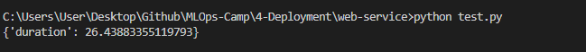

## Model Deployment
# 4. Model Deployment

## 4.1 Three ways of deploying a model
-   Batch Offline: You run your model regularly (hourly, daily, monthly). Pull the data from the DB and then apply the model.
-   Batch Online: It's running all the time. It's always available. You can run your models using Web Services (relationship 1 x 1 between client-server) and Streaming ( 1 x n relationship)


## 4.2 Web-services: Deploying models with Flask and Docker
### Install python, scikit learn and flask on a virtual environment with pipenv:
```
pipenv install scikit-learn==1.0.2 flask --python=3.9
```
### Go to the env with the command:
```
pipenv shell
```
## You can use anaconda to create the venv:
```
conda create -n web-service python=3.9
```
## Go to the env with the command:
```
conda activate web-service
```
### Install the dependencies:
```
pip install -r requirements.txt
```
## Work on predict.py
[See code here](web-service/)
## After you have finished predict.py and test.py, run predict.py on your virtual-enviroment and test.py on whatever you want to test your app.
```
(venv) python predict.py
(base) python test.py
```
- To avoid Flask warning, we can install gunicorn:
```
pip install gunicorn
```
## Run it using gunicorn:
```
gunicorn --bind=0.0.0.0:9696 predict:app
```
## Install requests on your virtual environment:
```
pip install requests
```
## Packaging the app to Docker:
- Create Dockerfile
- Make the image (make sure about your Python version, you can use python -V to check)
- Search for the python image in the Docker Hub, I'll select slim version (slim version is used for reducing the size of the image)
- Build the image with:
  ```
  docker build -t ride-duration-prediction-service:v1 . (Add winpty at the beggining to the command if you are using Windows)
  ```
  where:
  -   `ride-duration-prediction-service:v1` is the name of the image
  - t: v1 is the tag of the image
  -  `.` is the path to the directory where the Dockerfile is
- Test it with:
  ```
  docker run -it --rm -p 9696:9696  ride-duration-prediction-service:v1 and run the test.py
  ```
  where : 
  -   -it: Interactive mode
  -   --rm: Remove the container after it is done
  -   -p: Port mapping



## 4.3 Web-services: Getting the models from the model registry (MLflow)
### For this part, you'll need a S3 bucket.
I've just created a bucket called `mlflow-models-esteban`.
## Starting the MLflow server with S3:
```
mlflow server --backend-store-uri=sqlite:///mlflow.db --default-artifact-root=s3://mlflow-models-esteban/
```
## Run random-forest.ipynb
[Random Forest model](web-service/random-forest.ipynb)

[See content here](web-service-mlflow/)


## 4.4 (Optional) Streaming: Deploying models with Kinesis and Lambda 

<a href="https://www.youtube.com/watch?v=TCqr9HNcrsI&list=PL3MmuxUbc_hIUISrluw_A7wDSmfOhErJK">
  
</a>


[See code here](streaming/)


## 4.5 Batch: Preparing a scoring script

<a href="https://www.youtube.com/watch?v=18Lbaaeigek&list=PL3MmuxUbc_hIUISrluw_A7wDSmfOhErJK">
  
</a>


[See code here](batch/)


## 4.6 Batch: TBA

COMING SOON


## 4.7 Homework

COMING SOON


## Notes

Did you take notes? Add them here:

* Send a PR, add your notes above this line