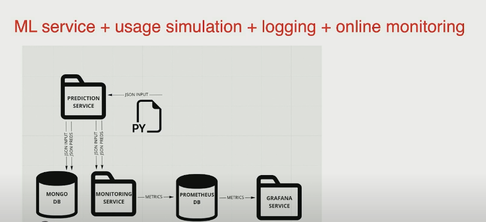
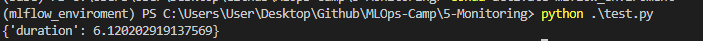

# 5. Model Monitoring


## 5.1 Monitoring for ML-based services
1. Add ML metrics to service health monitoring (Prometheus/Grafana)
2. Build an ML focused Dashboard(s) (MongoDB/Grafana or BI tools Tableu, Looker)



-   You can add batch monitoring to this system

### Working on prediction_service folder
1. Install all the libraries with `pip install -r requirements.txt`
2. Setting constants for the model (MODEL_FILE, MONGODB_ADDRESS, EVIDENTLY_SERVICE_ADDRESS)
3. Working on `app.py` file
4. Run `docker-compose up --build`
5. Test the app with `test.py`
6. You should see the app running on localhost:5000




## 5.2 Setting up the environment


## 5.3 Creating a prediction service and simulating traffic

<a href="https://www.youtube.com/watch?v=umQ3Mo5G1o8&list=PL3MmuxUbc_hIUISrluw_A7wDSmfOhErJK">
  
</a>


## 5.4 Realtime monitoring walktrough (Prometheus, Evidently, Grafana)

<a href="https://www.youtube.com/watch?v=r_m4VFEJ8yY&list=PL3MmuxUbc_hIUISrluw_A7wDSmfOhErJK">
  
</a>


## 5.5 Batch monitoring walktrough (Prefect, MongoDB, Evidently)

<a href="https://www.youtube.com/watch?v=KefdYuue_FE&list=PL3MmuxUbc_hIUISrluw_A7wDSmfOhErJK">
  
</a>


## 5.6 Homework

COMING SOON


# Monitoring example

## Prerequisites

You need following tools installed:
- `docker`
- `docker-compose` (included to Docker Desktop for Mac and Docker Desktop for Windows )

## Preparation

Note: all actions expected to be executed in repo folder.

- Create virtual environment and activate it (eg. `python -m venv venv && ./venv/bin/activate`)
- Install required packages `pip install -r requirements.txt`
- Run `python prepare.py` for downloading datasets

## Monitoring Example

### Starting services

To start all required services, execute:
```bash
docker compose up
```

It will start following services:
- `prometheus` - TSDB for metrics
- `grafana` - Visual tool for metrics
- `mongo` - MongoDB, for storing raw data, predictions, targets and profile reports
- `evidently_service` - Evindently RT-monitoring service (draft example)
- `prediction_service` - main service, which makes predictions

### Sending data

To start sending data to service, execute:
```bash
python send_data.py
```

This script will send every second single row from dataset to prediction service along with creating file `target.csv` with actual results (so it can be loaded after)

## Batch Monitoring Example

After you stop sending data to service, you can run batch monitoring pipeline (using Prefect) by running script:

```bash
python prefect_example.py
```

This script will:
- load `target.csv` to MongoDB
- download dataset from MongoDB
- Run Evidently Model Profile and Evidently Report on this data
- Save Profile data back to MongoDB
- Save Report to `evidently_report_example.html`

You can look at Prefect steps in Prefect Orion UI
(to start it execute `prefect orion start`)